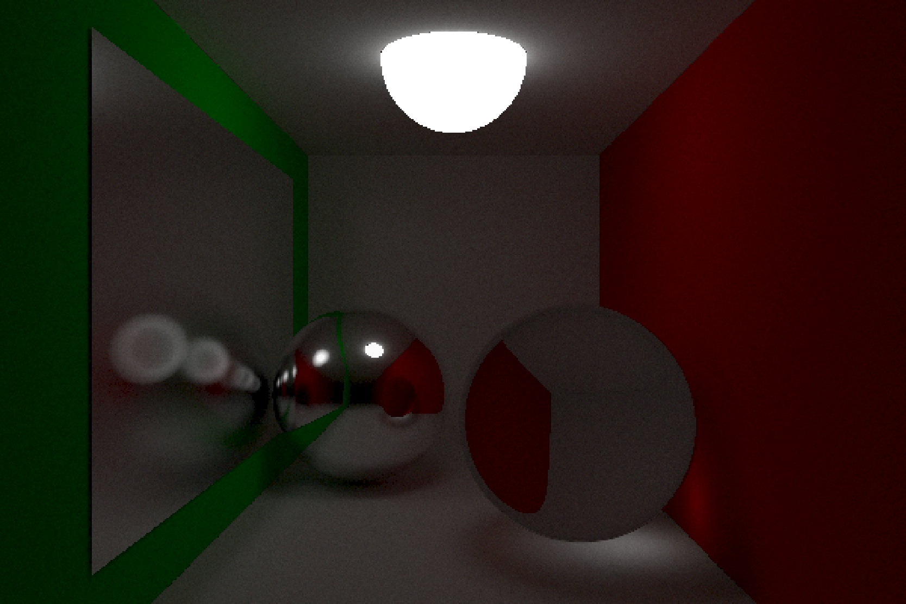

# Ray/Path Tracer

This repository is the final project for Photorealistic Graphics class at Lodz University of Technology.

The project is a CPU path tracer application.

It is recommended to run in release mode for faster renders. 

### Features
- Path tracing: Fuzzy Reflections, Refraction, Diffuse Lighting
- Cornell Box example scene
- `omp parallel for` for speed up of main path tracing loop
- renders to TGA format
